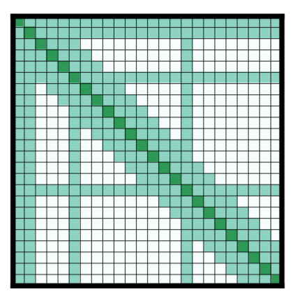

# Transformer 基础

## 1. Transformer 解决什么问题

Transformer 是一种处理序列数据的神经网络架构，最初用于机器翻译，现在广泛用于文本理解和文本生成。

它通过注意力机制直接建模序列中任意两个 Token 的关系，避免像 RNN 那样必须逐步传递信息，因此训练时更容易并行计算。

## 2. 语言模型、自监督学习与微调

### 语言模型

语言模型的工作原理是通过训练来预测给定上下文中某个词出现的概率。这使它们对语言有了基本的理解，并能推广到其他任务中。


训练Transformer模型主要有两种方法：
自监督预训练：自监督学习的训练目标可以直接从原始文本构造，不需要人工逐条标注。

掩码语言模型（MLM）：这种方法被BERT等编码器模型所采用，它会随机掩码输入中的一些词元，并训练模型根据上下文预测原始词元。这使得模型能够学习双向上下文（同时查看被掩码词之前和之后的词）。

因果语言模型（CLM）：这种方法被GPT等解码器模型所采用，它基于序列中所有先前的词元来预测下一个词元。该模型只能使用左侧（先前的词元）的上下文信息来预测下一个词元。


### 微调

预训练模型掌握通用语言规律后，再使用较小的任务数据集训练，使其适应分类、问答、NER 等具体任务。

微调比从零训练更省数据、时间和计算资源。

## 3. Transformer 三类架构

| 架构 | 代表模型 | 主要能力 | 常见任务 |
|---|---|---|---|
| Encoder-only | BERT | 理解输入 | 分类、NER、掩码填充 |
| Decoder-only | GPT | 自回归生成 | 文本生成、对话 |
| Encoder-Decoder | T5、BART | 根据输入生成输出 | 翻译、摘要 |

## 4. Encoder 与 Decoder

### Encoder
这类模型采用双向方法，从两个方向理解上下文。它们最适合需要深度理解文本的任务，例如分类、命名实体识别和问答。比如：BERT
编码器读取完整输入序列，为每个 Token 构建包含上下文信息的表示。

```text
输入句子 → Encoder → 上下文化表示
```

编码器中的自注意力通常可以查看输入句子的所有位置。

### Decoder
这类模型从左到右处理文本，尤其擅长文本生成任务。它们可以根据提示完成句子、撰写文章，甚至生成代码。比如 GPT、Llama
解码器根据已有目标序列生成下一个 Token。Encoder-Decoder 模型中的解码器还会读取编码器输出。

```text
已生成的目标词 + Encoder 输出 → Decoder → 下一个词
```

### Encoder-Decoder
编码器-解码器模型（例如 T5、BART）：这类模型结合了编码器和解码器两种方法，使用编码器理解输入，解码器生成输出。它们擅长序列到序列的任务，例如翻译、摘要和问答。


## 5. 注意力机制
大多数Transformer模型都使用完全注意力机制，即注意力矩阵是方阵。当处理长文本时，这会成为严重的计算瓶颈。Longformer和Reformer模型则力求提高效率，它们使用稀疏版本的注意力矩阵来加速训练。

`LSH Attention`
Reformer使用 LSH 注意力机制。在 softmax(QK^t) 中，只有矩阵 QK^t 中最大的元素（在 softmax 维度上）才会产生有效贡献。因此，对于 Q 中的每个查询 q，我们只需考虑 K 中与 q 接近的键 k。使用哈希函数来判断 q 和 k 是否接近。注意力掩码经过修改，屏蔽当前标记（第一个位置除外），因为这样会导致查询和键相等（彼此非常相似）。由于哈希值可能存在一定的随机性，因此在实践中会使用多个哈希函数（由 n_rounds 参数决定），然后取平均值。

`Local Attention`
Longformer使用局部注意力机制：通常情况下，局部上下文（例如，左侧和右侧的两个词元是什么？）足以对给定的词元采取相应的操作。此外，通过堆叠具有小窗口的注意力层，最后一层的感受野将不仅仅局限于窗口内的词元，从而能够构建整个句子的表征。

一些预先选定的输入标记也被赋予全局关注：对于这少数几个标记，注意力矩阵可以访问所有标记，并且这个过程是对称的：所有其他标记除了访问其局部窗口中的标记之外，还可以访问这些特定的标记。下面是一个注意力掩码示例：

使用参数较少的注意力矩阵，可以让模型处理序列长度更大的输入。

`轴向位置编码`
Reformer使用轴向位置编码：在传统的 Transformer 模型中，位置编码 E 是一个大小为 \(l\) × \(d\) 的矩阵，其中 \(l\) 是序列长度，\(d\) 是隐藏状态的维度。如果文本非常长，这个矩阵会非常庞大​​，占用 GPU 的大量空间。为了缓解这个问题，轴向位置编码将这个大矩阵 E 分解成两个较小的矩阵 E1 和 E2，它们的维度分别为 \(l_{1} \times d_{1}\) 和 \(l_{2} \times d_{2}\)，使得 \(l_{1} \times l_{2} = l\) 且 \(d_{1} + d_{2} = d\)（由于长度相乘，最终结果会小得多）。时间步 \(j\) 在 E 中的嵌入是通过连接时间步 \(j % l1\) 在 E1 中的嵌入和 \(j // l1\) 在 E2 中的嵌入而得到的。


注意力机制让模型在处理一个 Token 时，根据相关程度为其他 Token 分配不同权重。

例如：

```text
小明把书放进书包，因为他明天要上课。
```

理解“他”时，模型应重点关注“小明”。

注意力的核心思想：

```text
当前 Token 应该关注哪些 Token，以及关注多少？
```

## 6. 解码器中的两种注意力

Encoder-Decoder Transformer 的解码器通常包含两种注意力。

### 6.1 Masked Self-Attention

解码器关注目标序列中已经出现的 Token，但不能查看未来 Token。

预测“喜欢”时：

```text
可见：<BOS> 我
不可见：喜欢 NLP
```

这种限制由因果掩码实现。

### 6.2 Cross-Attention

解码器使用 Query 关注编码器输出，可以读取完整源句。

翻译示例：

```text
源句：I love NLP
目标：我 喜欢 NLP
```

预测任意目标词时：

- Masked Self-Attention 查看已知目标前文
- Cross-Attention 查看完整源句 `I love NLP`

因此，即使两种语言语序不同，模型也能利用源句后半部分的信息决定当前翻译。

## 7. 因果掩码

因果掩码禁止当前位置看到未来位置。训练时配合目标序列右移，当前位置不会直接拿到自己要预测的答案。

目标句：

```text
我 喜欢 NLP
```

可见关系：

| 预测位置 | 可以看到的目标输入 |
|---|---|
| 我 | `<BOS>` |
| 喜欢 | `<BOS> 我` |
| NLP | `<BOS> 我 喜欢` |

若预测“喜欢”时能直接看到真实的“喜欢”，模型只需复制答案，无法学习语言关系。

## 8. Teacher Forcing

训练时，目标句是数据集提供的标准答案。解码器输入是目标句右移一位后的结果。

```text
解码器输入：<BOS> 我 喜欢
监督目标：    我    喜欢 NLP
```

这会形成三个训练任务：

```text
<BOS>         → 预测“我”
<BOS> 我      → 预测“喜欢”
<BOS> 我 喜欢 → 预测“NLP”
```

关键点：

- 第二个任务使用真实的“我”，不使用第一个任务的预测结果
- 第三个任务使用真实的“我 喜欢”，不使用前两个任务的预测结果
- 每个位置的预测可能正确，也可能错误
- 所有预测分别与标准答案比较并计算损失

这种做法称为 Teacher Forcing。

## 9. 为什么训练可以并行

训练时完整目标句已知，因此所有位置需要的“真实前文”可以提前构造。

```text
位置 1 输入：<BOS>
位置 2 输入：<BOS> 我
位置 3 输入：<BOS> 我 喜欢
```

Transformer 不需要先完成位置 1 的预测，再开始位置 2。它把所有位置组成矩阵，一次送入 GPU 并行计算。

因果掩码只是让不同位置看到不同范围，不会迫使 GPU 按位置顺序执行。

## 10. 为什么推理不能完全并行

推理时没有标准答案，后一个位置的输入依赖前一个位置实际生成的结果。

```text
<BOS> → 生成“我”
<BOS> 我 → 生成“喜欢”
<BOS> 我 喜欢 → 生成“NLP”
```

如果第一步生成的不是“我”，第二步就必须使用模型实际生成的词。因此推理必须逐 Token 进行。

## 11. 训练与推理对比

| 对比项 | 训练 | 推理 |
|---|---|---|
| 目标句是否已知 | 已知 | 未知 |
| 后续输入来源 | 真实答案 | 模型预测 |
| 是否使用 Teacher Forcing | 是 | 否 |
| 是否可按序列位置并行 | 可以 | 通常不可以 |
| 是否需要因果掩码 | 需要 | 需要 |

## 12. 完整翻译流程

假设：

```text
源句：I love NLP
目标：我 喜欢 NLP
```

训练过程：

1. Encoder 一次读取完整源句。
2. Decoder 接收右移后的完整目标句 `<BOS> 我 喜欢`。
3. Masked Self-Attention 阻止每个目标位置看到未来词。
4. Cross-Attention 允许每个目标位置读取完整源句表示。
5. Decoder 并行预测 `我`、`喜欢`、`NLP`。
6. 将三个预测分别与真实目标比较。
7. 汇总损失并通过反向传播更新参数。

## 13. 自测问题

1. Encoder-only、Decoder-only、Encoder-Decoder 分别适合什么任务？
Encoder-only适合做文本分类，Decoder-only适合做生成任务，Encoder-Decoder做翻译与摘要
2. 为什么 Decoder 的自注意力需要因果掩码？
防止当前位置看到未来词。
3. Cross-Attention 能看到哪些信息？
完整的源句信息
4. Teacher Forcing 使用真实前文还是模型预测前文？
真实前文，加快训练速度
5. 为什么训练可以并行，而自回归推理通常不能？
训练使用的是真实前文，不用串行等待预测的前文。推理就是串行的
6. 如果训练时不右移目标序列，会出现什么问题？
防止当前位置直接看到当前正确答案，并建立“前文预测下一个词”的输入输出对齐。
