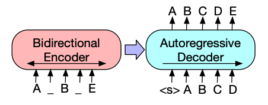
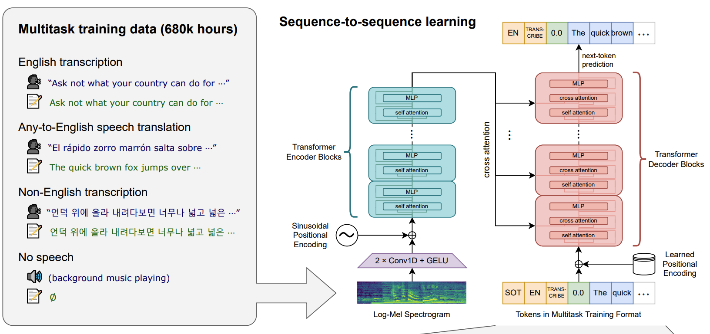
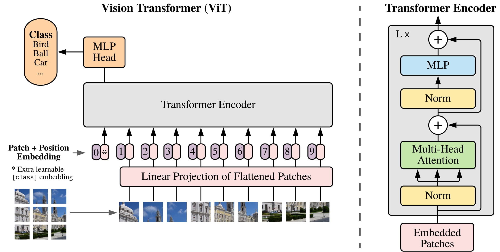
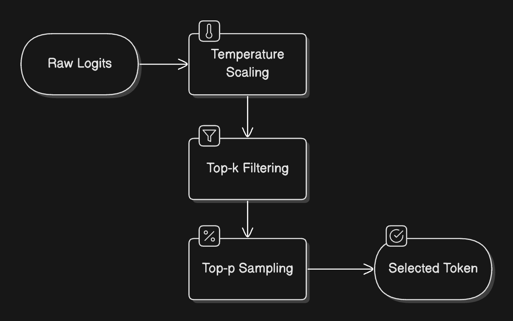

## 编码器模型
编码器模型仅使用 Transformer 模型的编码器部分。在每次计算过程中，注意力层都能访问整个句子的所有单词，这些模型通常具有“双向”（向前/向后）注意力，被称为自编码模型。

这些模型的预训练通常会使用某种方式破坏给定的句子（例如：通过随机遮盖其中的单词），并让模型寻找或重建给定的句子。

“编码器”模型适用于需要理解完整句子的任务，例如：句子分类、命名实体识别（以及更普遍的单词分类）和阅读理解后回答问题。

该系列模型的典型代表有：
ALBERT
BERT
DistilBERT
ELECTRA
RoBERTa

## 解码器模型
“解码器”模型仅使用 Transformer 模型的解码器部分。在每个阶段，对于给定的单词，注意力层只能获取到句子中位于将要预测单词前面的单词。这些模型通常被称为自回归模型。

“解码器”模型的预训练通常围绕预测句子中的下一个单词进行。

这些模型最适合处理文本生成的任务。

该系列模型的典型代表有：

CTRL
GPT
GPT-2
Transformer XL

## 编码器-解码器模型

编码器-解码器模型（也称为序列到序列模型）同时使用 Transformer 架构的编码器和解码器两个部分。在每个阶段，编码器的注意力层可以访问输入句子中的所有单词，而解码器的注意力层只能访问位于输入中将要预测单词前面的单词。

这些模型的预训练可以使用训练编码器或解码器模型的方式来完成，但通常会更加复杂。例如， T5 通过用单个掩码特殊词替换随机文本范围（可能包含多个词）进行预训练，然后目标是预测被遮盖单词原始的文本。

序列到序列模型最适合于围绕根据给定输入生成新句子的任务，如摘要、翻译或生成性问答。

该系列模型的典型代表有：

BART
mBART
Marian
T5

# 具体任务与模型

## 文本生成
文本生成是指根据提示或输入创建连贯且与上下文相关的文本。

GPT-2是一个仅包含解码器的模型，它使用大量文本进行预训练。根据提示，它可以生成令人信服（尽管并非总是正确！）的文本，并且能够完成其他自然语言处理任务，例如问答，尽管它并没有专门针对这些任务进行训练。

GPT-2 使用字节对编码 (BPE)对单词进行分词并生成词嵌入。词嵌入中添加位置编码，以指示每个词在序列中的位置。输入的词嵌入经过多个解码器模块，最终输出隐藏状态。在每个解码器模块中，GPT-2 使用掩码自注意力层，这意味着 GPT-2 无法关注后续的词，只能关注左侧的词。这与 BERT 的 [mask] 词不同，因为在掩码自注意力机制中，使用注意力掩码把后续词的注意力 logits 设为极小值，softmax 后这些位置的注意力权重接近 0。

解码器的输出会传给语言建模头。语言建模头通常是一个线性层，它把每个位置的隐藏状态转换成 logits，也就是对词表中每个 token 的原始打分。训练时，模型用当前位置的 logits 预测下一个 token：例如看到“我”，预测“喜欢”；看到“我 喜欢”，预测“NLP”。然后把预测结果和真实的下一个 token 计算交叉熵损失。

GPT-2 的预训练目标完全基于因果语言模型，即预测序列中的下一个词。这使得 GPT-2 在生成文本的任务中表现尤为出色。

## 文本分类
文本分类是指将预定义的类别分配给文本文件，例如情感分析、主题分类或垃圾邮件检测。

BERT是一个仅包含编码器的模型，它是第一个有效实现深度双向性的模型，通过关注文本两侧的词语来学习更丰富的文本表示。

BERT 使用WordPiece分词生成文本的词嵌入。为了区分单个句子和句子对，BERT[SEP]会添加一个特殊标记来区分它们。这个特殊[CLS]标记会被添加到每个文本序列的开头。最终的输出结果（包含该[CLS]标记）会作为分类头的输入，用于分类任务。此外，BERT 还会添加一个段嵌入，用于指示某个标记属于句子对中的第一个句子还是第二个句子。

BERT 的预训练目标有两个：掩码语言建模和下一句预测。在掩码语言建模中，一部分输入词元会被随机掩码，模型需要预测这些被掩码的词元。这解决了双向性问题，避免了模型作弊，看到所有词元并“预测”下一个词的情况。预测出的掩码词元的最终隐藏状态会被传递给一个前馈网络，该网络使用 softmax 函数处理词汇表，以预测被掩码的词。

第二个预训练对象是下一句预测。模型必须预测句子 B 是否紧跟在句子 A 之后。句子 B 有一半时间是下一句，另一半时间则是一个随机句子。预测结果（是否为下一句）被传递给一个前馈网络，该网络使用 softmax 函数对两个类别（IsNext和NotNext）进行处理。

输入嵌入经过多个编码器层，最终输出一些隐藏状态。

要使用预训练模型进行文本分类，需要在基础 BERT 模型之上添加一个序列分类头。序列分类头是一个线性层，它接收最终的隐藏状态，并执行线性变换将其转换为 logits。然后计算 logits 和目标值之间的交叉熵损失，以找到最可能的标签。

## 词元分类
词元分类是指为序列中的每个词元分配一个标签，例如在命名实体识别或词性标注中。

要使用 BERT 进行命名实体识别 (NER) 等词元分类任务，需要在基础 BERT 模型之上添加一个词元分类头。词元分类头是一个线性层，它接收最终的隐藏状态，并执行线性变换将其转换为 logits。然后计算 logits 与每个词元之间的交叉熵损失，以找到最可能的标签。

## 问答
问答是指在给定的语境或段落中寻找问题的答案。

要使用 BERT 进行问答，需要在基础 BERT 模型之上添加一个跨度分类头。该线性层接收最终的隐藏状态，并执行线性变换以计算span与答案对应的起始和结束 logits。然后计算 logits 与标签位置之间的交叉熵损失，以找到与答案最匹配的文本跨度。

# BERT 预训练完成后，用于不同任务是多么容易。只需要向预训练模型添加一个特定的头部，就能将隐藏状态调整为你想要的输出！

## 摘要
摘要是指将较长的文本浓缩成较短的版本，同时保留其关键信息和含义。

Encoder：双向理解，适合分类、NER、填空。
Decoder：从左到右生成，适合文本生成。
左边看上下文补空。
右边根据前文预测下一个词。

像BART和T5这样的编码器-解码器模型是专为文本摘要任务中的序列到序列模式而设计的。本节将解释 BART 的工作原理，最后您可以尝试微调 T5。

BART 的编码器架构与 BERT 非常相似，它接受文本的词元和位置嵌入。BART 的预训练方法是先对输入进行损坏，然后再用解码器重建输入。与其他具有特定损坏策略的编码器不同，BART 可以应用任何类型的损坏。其中，文本填充损坏策略效果最佳。在文本填充中，若干文本跨度被替换为单个方括号[mask] 标记。这一点至关重要，因为模型需要预测被掩码的标记，而文本填充策略可以教会模型预测缺失标记的数量。输入嵌入和被掩码的跨度会通过编码器输出一些最终的隐藏状态，但与 BERT 不同的是，BART 不会在最后添加一个前馈网络来预测单词。

编码器的输出被传递给解码器，解码器需要根据编码器的输出预测被掩码的词元以及任何未被掩码的词元。这为解码器提供了额外的上下文信息，帮助其恢复原始文本。解码器的输出被传递给语言建模头，语言建模头执行线性变换，将隐藏状态转换为逻辑值（logits）。logits 会与真实目标序列对齐后计算交叉熵损失，本质上仍是在训练模型根据前文和编码器输出预测下一个 token。

## 翻译
翻译是指在保持原意不变的前提下，将文本从一种语言转换成另一种语言。翻译是序列到序列任务的又一个例子，这意味着你可以使用像BART或T5这样的编码器-解码器模型来完成它。本节将解释 BART 的工作原理，最后你可以尝试对 T5 进行微调。

BART 通过添加一个独立的、随机初始化的编码器来适应翻译任务，该编码器将源语言映射到可解码为目标语言的输入。这个新编码器的词嵌入被传递给预训练的编码器，而不是原始的词嵌入。源编码器的训练方法是：利用模型输出的交叉熵损失来更新源编码器、位置嵌入和输入嵌入。在第一步中，模型参数被冻结；在第二步中，所有模型参数一起训练。

#  Transformer 模型如何处理语音和音频数据

Whisper是一个编码器-解码器（序列到序列）Transformer 模型，它基于 68 万小时的带标签音频数据进行预训练。如此庞大的预训练数据量使得 Whisper 能够在英语和许多其他语言的音频任务上实现零样本性能。解码器使 Whisper 能够将编码器学习到的语音表示映射到有用的输出（例如文本），而无需额外的微调。Whisper 开箱即用。

该模型包含两个主要组成部分：

编码器处理输入音频。原始音频首先被转换为对数梅尔频谱图。然后，该频谱图通过Transformer编码器网络进行处理。

解码器接收编码后的音频表示，并利用自回归算法预测相应的文本标记。它是一个标准的Transformer解码器，经过训练，能够根据之前的文本标记和编码器的输出预测下一个文本标记。解码器输入的开头会使用特殊的标记，以引导模型执行特定的任务，例如转录、翻译或语言识别。

## 自动语音识别
要使用预训练模型进行自动语音识别，需要利用其完整的编码器-解码器结构。编码器处理音频输入，解码器则逐个词元地自回归生成转录文本。在微调模型时，通常使用标准的序列到序列损失函数（例如交叉熵损失）来训练模型，以便根据音频输入预测正确的文本词元。
[示例](../notebooks/day02.ipynb)

#  Transformer 模型在计算机视觉上的应用

计算机视觉任务有两种处理方法：

将图像分割成一系列图像块，并使用 Transformer 并行处理它们。
使用现代 CNN，例如ConvNeXT，它依赖于卷积层，但采用了现代网络设计。
第三种方法是将Transformer与卷积相结合（例如，卷积视觉Transformer或LeViT）

ViT 和 ConvNeXT 通常用于图像分类，但对于其他视觉任务，如目标检测、分割和深度估计，我们将分别考虑 DETR、Mask2Former 和 GLPN；这些模型更适合这些任务。

## 图像分类
图像分类是计算机视觉的基本任务之一。让我们来看看不同的模型架构是如何解决这个问题的。

ViT 和 ConvNeXT 都可用于图像分类；主要区别在于 ViT 使用注意力机制，而 ConvNeXT 使用卷积。

ViT完全用纯 Transformer 架构取代了卷积运算。

ViT引入的主要变化在于图像输入到Transformer的方式：
图像被分割成互不重叠的正方形图像块，每个图像块都被转换成一个向量或图像块嵌入。这些图像块嵌入由一个二维卷积层生成，该卷积层生成合适的输入维度（对于基础Transformer模型，每个图像块嵌入包含768个值）。例如，如果图像大小为224x224像素，则可以将其分割成196个16x16像素的图像块。就像文本被分词成单词一样，图像也被“分词”成一系列图像块。

与 BERT 类似，在图像块嵌入的开头会添加一个可学习的嵌入（一个特殊标记）。该标记的最终隐藏状态会作为附加分类头的输入；其他输出会被忽略。这个标记帮助模型学习如何对图像表示进行编码。[CLS][CLS]

最后，除了图像块嵌入和可学习嵌入之外，还需要添加位置嵌入，因为模型并不知道图像块的顺序。位置嵌入也是可学习的，并且大小与图像块嵌入相同。最后，所有嵌入都被传递给Transformer编码器。

输出结果（特指包含[CLS]标记的输出结果）被传递给多层感知器（MLP）头。ViT 的预训练目标很简单，就是分类。与其他分类头类似，MLP 头将输出结果转换为类别标签的 logits，并计算交叉熵损失以找到最可能的类别。

# 深入探讨使用LLM进行文本生成推理
## 推理
是指使用训练好的语言模型（LLM）根据给定的输入提示生成类似人类语言的文本的过程。语言模型利用训练中积累的知识，逐字逐句地生成响应。该模型利用从数十亿个参数中学习到的概率来预测和生成序列中的下一个词元。正是这种顺序生成的方式使得语言模型能够生成连贯且与上下文相关的文本。

## 注意力机制
赋予语言学习模型（LLM）理解上下文并生成连贯响应的能力。在预测下一个词时，句子中的每个词并非都具有相同的权重——例如，在句子“法国的首都是……”中，“法国”和“首都”这两个词对于确定下一个词应该是“巴黎”至关重要。这种专注于相关信息的能力就是我们所说的注意力。

## 上下文长度和注意力持续时间
上下文长度指的是语言学习模型（LLM）一次可以处理的最大词元数。可以把它理解为模型的工作内存大小。

这些能力受到几个实际因素的限制：
该模型的架构和尺寸
可用计算资源
输入和期望输出的复杂性

理想情况下，我们可以向模型输入无限量的上下文信息，但硬件限制和计算成本使得这不切实际。因此，不同的模型被设计成具有不同的上下文长度，以平衡模型的性能和效率。

## 提示
当我们向逻辑学习模型（LLM）传递信息时，我们会以某种方式组织输入，引导LLM生成所需的输出。这被称为提示。
由于该模型的主要任务是通过分析每个输入词元的重要性来预测下一个词元，因此输入序列的措辞至关重要。
精心设计的提示可以更容易地引导 LLM 生成达到预期的输出结果。

# 两阶段推理过程
语言学习模型（LLM）生成文本的过程可以分为两个主要阶段：预填充和解码。这两个阶段像流水线一样协同工作，每个阶段都在生成连贯文本的过程中发挥着至关重要的作用。

## 预填充阶段
预填充阶段就像烹饪中的准备阶段——所有初始食材都在此阶段进行加工和准备。该阶段包含三个关键步骤：

分词：将输入文本转换为词元（可以把词元想象成模型理解的基本构建块）。
嵌入转换：将这些词元转换为能够捕捉其含义的数值表示。
初始处理：将这些嵌入向量输入模型的神经网络，以深入了解上下文。

这个阶段计算量很大，因为它需要一次性处理所有输入词元。可以把它想象成在开始写回复之前，先阅读并理解一整段文字。

## 解码阶段
预填充阶段处理完输入后，我们进入解码阶段——这是实际生成文本的阶段。模型一次生成一个词元，我们称之为自回归过程（其中每个新词元都依赖于所有先前的词元）。

解码阶段包含针对每个新令牌执行的几个关键步骤：

注意力计算：回顾所有先前的词元以理解上下文
概率计算：确定下一个可能出现的元素的概率。
Token选择：根据这些概率选择下一个Token
持续性检查：决定是否继续或停止生成

此阶段会占用大量内存，因为模型需要跟踪所有先前生成的标记及其关系。

# 抽样策略
控制生成过程的各种方法。就像作家可以选择更具创意还是更精确一样，我们也可以调整模型选择词元的方式。

## 从概率到 Token 选择
当模型需要选择下一个词元时，它首先会得到词汇表中每个词的原始概率（称为logits），再将这些概率转化为实际的选择呢

原始逻辑值：可以将其视为模型对每个可能的下一个词的初始直觉。
温度控制：就像一个创意旋钮——较高的设置（>1.0）会使选择更随机、更具创造性，较低的设置（<1.0）会使选择更集中、更具确定性。
核心抽样：我们不考虑所有可能的词语，而是只关注那些概率总和达到我们选定的阈值（例如，前 90%）的最有可能的词语。
Top-k 过滤：一种替代方法，其中我们只考虑最有可能的 k 个下一个词。

## 避免重复：保持输出新鲜感
LLM（逻辑模型）面临的一个常见挑战是其重复性问题——就像演讲者不断重复相同的观点一样。为了解决这个问题，我们采用了两种惩罚机制：

出现惩罚：对任何已出现过的词元施加固定惩罚，无论其出现频率如何。这有助于防止模型重复使用相同的词语。
频度惩罚：一种根据词元使用频率递增的惩罚机制。一个词出现得越多，再次被选中的可能性就越小。

这些惩罚项在词元选择过程的早期阶段就已应用，在应用其他采样策略之前调整原始概率。可以将其理解为温和的引导，鼓励模型探索新的词汇。

## 控制生成长度：设定边界
就像好的故事需要合适的节奏和篇幅一样，我们也需要控制LLM生成的文本量。

Token限制：设置最小和最大Token数量
停止序列：定义表示生成结束的特定模式。
序列结束检测：让模型自然地结束其响应
例如，如果我们只想生成一个段落，可以将最大词元数设置为 100，并使用“\n\n”作为停用符。这样可以确保输出内容简洁明了，并且大小符合其用途。

## 波束搜索：提高连贯性
束搜索采用了一种更全面的方法。它不是在每一步都做出单一的选择，而是同时探索多条可能的路径——就像棋手提前思考几步棋一样。

它的运作方式如下：

在每个步骤中，维护多个候选序列（通常为 5-10 个）。
对于每个候选词，计算其成为下一个标记的概率。
只保留最有希望的序列和后续标记组合。
重复此过程，直至达到所需长度或停止。
选择总体概率最高的序列

这种方法通常能生成更连贯、语法更正确的文本，但与更简单的方法相比，它需要更多的计算资源。

# 实际挑战与优化
部署这些模型时面临的实际挑战，以及如何衡量和优化它们的性能。

## 关键性能指标
首次Token响应时间 (TTFT)：您多久能获得首次响应？这对于用户体验至关重要，并且主要受预填充阶段的影响。
每次输出Token所需时间 (TPOT)：生成后续Token的速度有多快？这决定了整体生成速度。
吞吐量：您可以同时处理多少个请求？这会影响扩展性和成本效益。
显存使用情况：你需要多少GPU内存？这通常会成为实际应用中的主要瓶颈。

## 上下文长度挑战
内存使用量：随上下文长度呈二次方增长
处理速度：随上下文时间延长而线性下降
资源分配：需要仔细平衡显存使用量

## KV 缓存优化
为了应对这些挑战，最有效的优化方法之一是键值 (KV) 缓存。这项技术通过存储和重用中间计算结果，显著提高了推理速度。这项优化：

减少重复计算
提高产生速度
使大文本窗口生成成为可能
这样做的代价是会占用更多内存，但性能提升通常远远超过这一成本。

## 今日知识总结

### Encoder、Decoder 与 Encoder-Decoder

今天主要学习了 Transformer 在不同任务中的三类使用方式。Encoder-only 模型以 BERT 为代表，它的核心能力是理解完整输入。Encoder 的自注意力通常可以同时看到一个 Token 左右两侧的信息，因此适合文本分类、命名实体识别、抽取式问答、掩码填空等理解类任务。Decoder-only 模型以 GPT、GPT-2 为代表，它的核心能力是根据前文自回归生成后续 Token，因此适合文本生成、对话和续写任务。Encoder-Decoder 模型以 T5、BART、Whisper 为代表，Encoder 负责理解输入，Decoder 根据 Encoder 输出生成目标序列，适合摘要、翻译、生成式问答和语音识别等序列到序列任务。

### BERT 的掩码语言模型

BERT 的掩码语言模型（MLM）不是让模型在没有答案的情况下乱猜。训练数据一开始就是完整句子，程序会随机把其中一部分 Token 替换成 `[MASK]`，然后用原句中被遮住的 Token 作为监督答案。模型猜测的依据来自上下文、词语搭配、语法位置和语义关系。例如输入“我 喜欢 `[MASK]` NLP”时，模型会根据“喜欢”和“NLP”判断中间更可能是“学习”“研究”“使用”这类词。训练早期模型可能接近随机猜测，但每次预测错误都会通过损失函数更新参数，经过大量文本训练后，模型逐渐学到语言中的统计规律。

### `[MASK]` 与注意力掩码

`[MASK]` 和 attention mask 都叫“mask”，但含义不同。BERT 的 `[MASK]` 是输入序列中的真实特殊 Token，表示这个位置的词被故意遮住，需要模型根据上下文恢复。Decoder 中的注意力掩码不是一个词，而是一套控制可见范围的规则。它决定当前位置能看哪些 Token、不能看哪些 Token。在因果注意力中，未来位置的注意力 logits 会被设为极小值，经过 softmax 后这些位置的注意力权重接近 0，因此模型无法利用未来词作弊。

### 隐藏状态、logits 与语言建模头

隐藏状态是模型内部对每个 Token 的上下文化向量表示。文本先经过 Tokenizer 变成 Token ID，再被转换成 embedding，经过多层 Transformer 后，每个位置都会得到一个隐藏状态。这个隐藏状态包含 Token 本身含义、位置关系以及它和上下文中其他 Token 的联系。语言建模头通常是一个线性层，它把隐藏状态转换成词表大小的 logits。logits 是模型对每个候选 Token 的原始打分，可以是负数，也不要求总和为 1。经过 softmax 后，logits 才会变成概率，用于选择下一个 Token 或计算交叉熵损失。

### GPT-2 的下一个 Token 预测

GPT-2 的训练目标是因果语言建模，也就是根据前文预测下一个 Token。更准确地说，模型用当前位置的 logits 去预测下一个 Token，而不是“把 logits 向右移动”。例如输入序列是“我 喜欢 NLP”，训练时可以形成“看到我，预测喜欢”“看到我 喜欢，预测 NLP”这样的监督关系。预测结果会和真实的下一个 Token 计算交叉熵损失，预测越接近正确答案，损失越小；预测越离谱，损失越大。

### 摘要、翻译与序列到序列任务

摘要和翻译都属于序列到序列任务，适合使用 Encoder-Decoder 架构。摘要任务要求模型先理解一段长文本，再生成更短但保留核心信息的文本；翻译任务要求模型理解源语言句子，再生成目标语言句子。BART 的训练方式是先破坏输入文本，再让模型重建原文；T5 会把一段连续文本替换成特殊掩码 Token，然后训练模型生成被遮住的原始文本。这类训练方式让模型学会根据输入条件生成完整输出。

### Whisper、ViT 与多模态 Transformer

Transformer 不只用于文本。Whisper 使用 Encoder-Decoder 架构处理语音识别任务，Encoder 读取音频转换后的特征，Decoder 自回归生成文本转录结果。ViT 则把图像切分成一个个图像块，把图像块当作类似文本 Token 的输入，再送入 Transformer Encoder 做图像分类。它们说明 Transformer 的核心思想不是只处理文字，而是处理“序列化后的信息”：文本可以切成 Token，图像可以切成 Patch，音频也可以转换成特征序列。

### 预填充、解码与 KV 缓存

LLM 推理可以分为预填充和解码两个阶段。预填充阶段会一次性处理完整提示词，建立初始上下文表示；解码阶段逐个生成新 Token，每一步都依赖已经生成的内容。训练时可以并行，是因为正确目标序列已知；推理时不能完全并行，是因为下一个 Token 的输入取决于上一步实际生成结果。KV 缓存会保存已经计算过的 Key 和 Value，避免每生成一个新 Token 都重新计算全部历史上下文，从而提高生成速度，但代价是占用更多显存。

### 采样策略与生成控制

生成文本时，模型先输出 logits，再根据采样策略选择下一个 Token。温度用于控制随机性，温度越高，输出越发散；温度越低，输出越确定。Top-k 只保留概率最高的 k 个候选 Token，Top-p 只保留累计概率达到阈值的一组候选 Token。重复惩罚会降低已经出现过的 Token 再次被选择的概率，用来减少重复输出。波束搜索会同时保留多条候选路径，通常能生成更稳定的句子，但计算开销更高。
